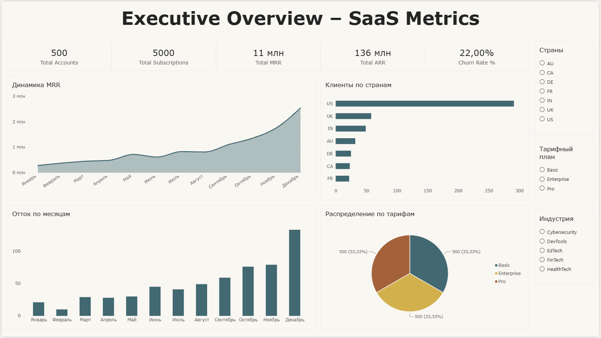
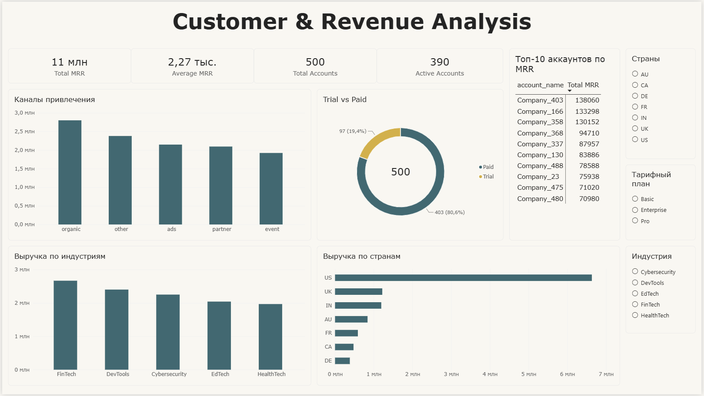
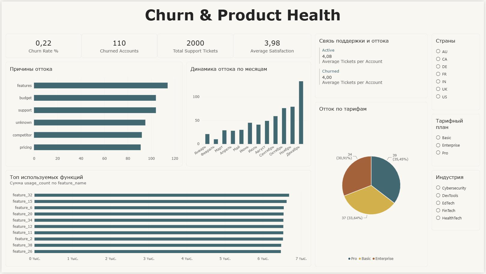

# SaaS Product Analytics Dashboard

## Описание проекта
Интерактивный дашборд по продуктовой аналитике SaaS-платформы (RavenStack).  
Анализ подписок, выручки (MRR/ARR), оттока клиентов, использования функций и поддержки.

## Данные
- Источник: [SaaS Subscription & Churn Analytics Dataset](https://www.kaggle.com/datasets/rivalytics/saas-subscription-and-churn-analytics-dataset)
- Таблицы: accounts (500), subscriptions (5000), feature_usage (25000), support_tickets (2000), churn_events (600)

## Инструменты
- Power BI Desktop
- Power Query
- DAX

## Структура дашборда

**Страница 1. Executive Overview**
- Ключевые метрики: Accounts, Subscriptions, MRR, ARR, Churn Rate
- Динамика MRR
- Распределение по тарифам
- Отток по месяцам

**Страница 2. Customer & Revenue Analysis**
- Выручка по странам и индустриям
- Trial vs Paid
- Каналы привлечения
- Топ-аккаунты по MRR

**Страница 3. Churn & Product Health**
- Причины оттока
- Связь поддержки и churn
- Использование функций продукта
- Динамика оттока

## Визуализации

### Executive Overview


### Customer & Revenue Analysis


### Churn & Product Health


## Структура проекта
```
03-product-dashboard/
├── data/
├── powerbi/
│   └── SaaS_Product_Analytics_Dashboard.pbix
├── images/
├── README.md
└── .gitignore
```

## Автор
Veta Suhih | Junior Data Analyst  
GitHub: [veta-suhih](https://github.com/veta-suhih) | LinkedIn: [vetasuhih](www.linkedin.com/in/vetasuhih)